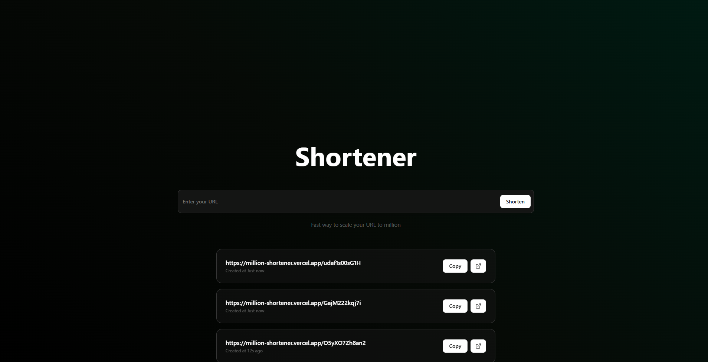
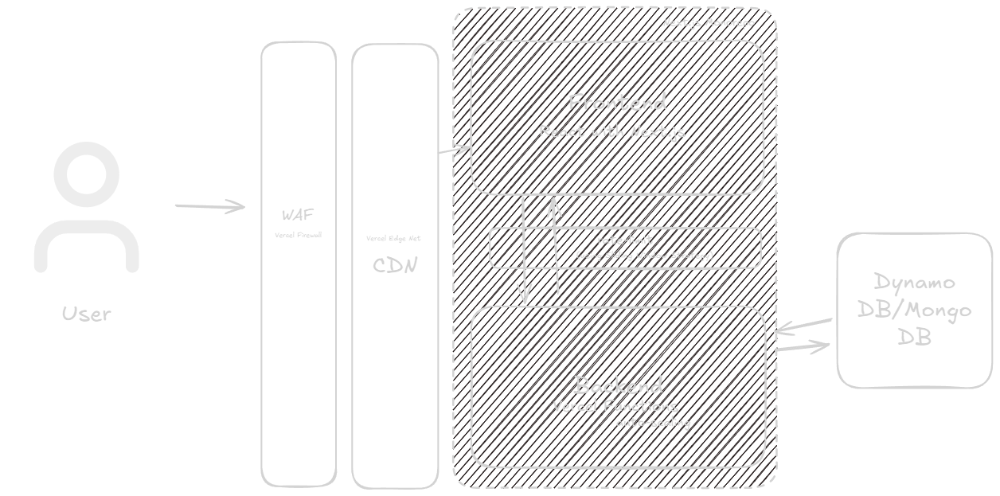

# Your URL to millions
**Know [how](#scalable-way) we scale our url to millions**



## Scalable to millions



Our achieve here is that you url never goes down, so we follow some steps:

- **Unlimited URLs**: To provide millions of url we need a way to pass this estimative, so we use [nanoid](https://github.com/ai/nanoid), with your params we garante ~919 years or 8B IDs needed, in order to have a 1% probability of at least one collision.

- **Mongo is a religion**: For storage this urls we need a huge database and fast too, so [MongoDB](https://www.mongodb.com/) Running at [atlas](https://www.mongodb.com/products/platform/atlas-database) to garante and globally distributed data storage.

- **Everywhere in the world**: If we have a globally storage we need a way to provide it to every place in the world this is why we pick Vercel as your CDN, using [Edge Network](https://vercel.com/docs/edge-network) we provide this app and the redirects for multiple regions around the world.

- **Unlimited Redirects**: And if the redirect goes down? We use [Next.js](https://nextjs.org/) working with SSR and [Vercel Functions](https://vercel.com/docs/functions) to provide a huge and unlimited serverless backend.

- **Almost Unlimited**: Yes, we have a rate-limit **only set in production**, this is for prevent to many url created hourly. And to set it we use a [Sliding Window Strategy](https://upstash.com/docs/redis/sdks/ratelimit-ts/algorithms#sliding-window).

- **Security**: Nothing more sad than a million service without security for that we use also [Vercel WAF](https://vercel.com/docs/vercel-firewall/vercel-waf), that able us to block and monitor everything it's happen in the network. Also we have a huge [captcha](https://developers.google.com/recaptcha?hl=pt-br) to block flooders. 

## How to run locally

### 1. Clone the repository

```bash
git clone https://github.com/Ellathet/million-shortener.git
cd million-shortener
```

### 2. Install dependencies

```bash
pnpm install
```

### 3. Set up environment variables

Copy the example environment file and fill in the required values:

```bash
cp .env.example .env
```

Edit `.env` and set the following variables:

- `MONGODB_URI` - MongoDB connection string (e.g., `mongodb://localhost:27017/`)
- `NEXT_PUBLIC_RECAPTCHA_SITE_KEY` - Your Google reCAPTCHA site key
- `RECAPTCHA_SECRET_KEY` - Your Google reCAPTCHA secret key

### 4. Run the development server

```bash
pnpm dev
```

Open [http://localhost:3000](http://localhost:3000) with your browser to see the result.

---

## Working with Docker

You can run the app and MongoDB using Docker Compose, after [install the packages](#2.-install-dependencies) we can run:

```bash
docker-compose up --build
```

This will:
- Build the Next.js app using the `Dockerfile`
- Start a MongoDB container
- Expose the app on [http://localhost:3000](http://localhost:3000)

The `MONGODB_URI` is set automatically for the app container to connect to the MongoDB service.

### Stopping the containers

Press `Ctrl+C` in the terminal, then run:

```bash
docker-compose down
```

---

## Project Structure

- `src/app/` - Next.js app directory
- `src/lib/` - Utility libraries (MongoDB, reCAPTCHA, etc.)
- `src/models/` - Data models
- `src/components/` - React components

---

## Learn More

To learn more about Next.js, take a look at the following resources:

- [Next.js Documentation](https://nextjs.org/docs) - learn about Next.js features and API.
- [Learn Next.js](https://nextjs.org/learn) - an interactive Next.js tutorial.

You can check out [the Next.js GitHub repository](https://github.com/vercel/next.js) - your feedback and contributions are welcome!

## Deploy on Vercel

The easiest way to deploy your Next.js app is to use the [Vercel Platform](https://vercel.com/new?utm_medium=default-template&filter=next.js&utm_source=create-next-app&utm_campaign=create-next-app-readme) from the creators of Next.js.

Check out our [Next.js deployment documentation](https://nextjs.org/docs/app/building-your-application/deploying) for more details.